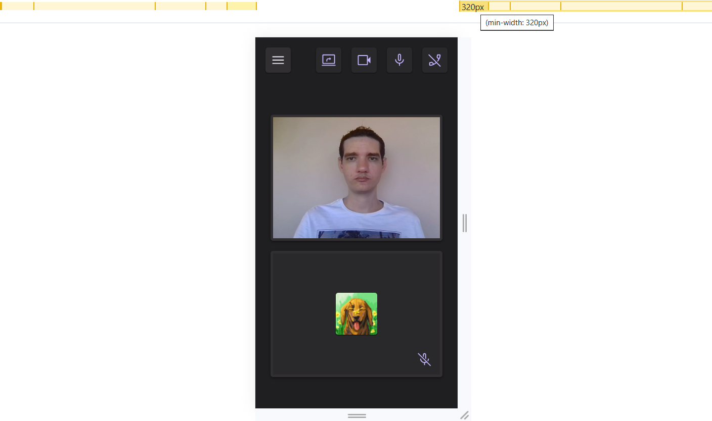
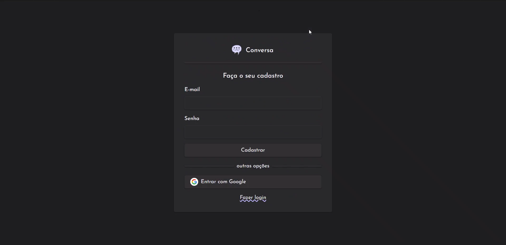
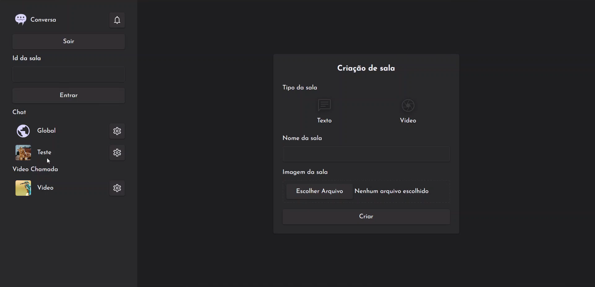

<p align="center">
    
</p>  

<p align="center">
  
</p>

<!-- TABLE OF CONTENTS -->

<h5 align="center">
<a href="#sobre">Sobre</a>
   •   <a href="#tecnologias">Tecnologias</a>
   •   <a href="#funcionalidades">Funcionalidades</a>
   •   <a href="#instalação">Instalação</a>
   •   <a href="#publicação">Publicação</a>
   •   <a href="#licença">Licença</a>
   •   <a href="#autor">Autor</a>
</h5>

## Sobre

<h4>Conversa é uma plataforma de conversação que permite a realização de bate-papo em texto e de videoconferência. Cadastre-se, crie sua sala de bate-papo/videoconferência, partilhe a sala com as pessoas, comece a conversar.</h4>

As chamadas de video utilizam a tecnologia [WebRTC](https://webrtc.org/)(*Web Real-Time Communication* - Comunicação Web em Tempo Real) que permite que *websites* transmitem mídia de áudio e/ou vídeo através de navegadores web estabelecendo conexões entre si. Essas conexões são estabelecidas por meio de um processo de sinalização que envolve um servidor, mas apenas para redes locais para redes remotas que podem conter roteadores e firewalls não funciona sozinho, então é necessário outro servidor, STUN(*Session Traversal Utilities for NAT*) que estabelece a conexão através de NAT ou TURN(*Traversal Using Relays around NAT*) que incrementa STUN possibilitando a conexão através de firewalls.
O servidor com o processo de sinalização foi realizado em conjunto com o [firebase](https://firebase.google.com/), e o servidor TURN com o [metered](https://www.metered.ca/) (versão gratuita).

Outras funcionalidades como autenticação e a comunicação em tempo real relacionada ao bate-papo também foram realizadas em conjunto com o firebase utilizando as ferramentas *Authentication* e *Realtime Database*. 

## Tecnologias

* [TypeScript](https://www.typescriptlang.org/)
* [Reactjs](https://react.dev/)
* [Vitejs](https://vitejs.dev/)
* [styled-components](https://styled-components.com/)
* [React Router Dom](https://reactrouter.com/)
* [Radix-ui](https://www.radix-ui.com/)
* [Firebase](https://firebase.google.com/)
* [WebRTC](https://webrtc.org/)
* [React Hook Form](https://react-hook-form.com/)
* [Zod](https://zod.dev/)
* [React Toastify](https://fkhadra.github.io/react-toastify/introduction)
* [Scroll into view](https://www.npmjs.com/package/scroll-into-view)
* [React responsive](https://github.com/yocontra/react-responsive)
* [Rect Scaler](https://github.com/fzembow/rect-scaler)
* [DateFNS](https://date-fns.org/)

> Veja o arquivo  [package.json](/package.json)

## Funcionalidades

<details open>
  <summary>Responsividade para as larguras:</summary>

  * [x] 320px
  * [x] 360px
  * [x] 412px
  * [x] 640px
  * [x] 768px
  * [x] 1024px
  * [x] 1280px
  * [x] 1366px
  * [x] 1440px
</details>

<details open>
  <summary>Página inicial - Cadastro</summary>

  * [x] Dialog com breve apresentação do projeto e contatos pessoais;
  * [x] O usuário poderá se cadastrar e iniciar/encerrar sessão na aplicação;
</details>

<details open>
  <summary>Página de criação de sala</summary>
  
  * Apenas usuários cadastrados podem acessar essa página.
  * [x] O usuário deve fornecer as seguintes informações ao criar uma sala:
    * Tipo de sala: `chat` ou `video`.
    * Nome da sala.
    * Imagem da sala.
  * [x] Não há limite de criação de salas por usuário;
</details>

<details open>
  <summary>Página de sala de bate-papo</summary>
  
  * Apenas usuários cadastrados podem acessar essa página.
  * [x] Input para enviar mensagem deve ter posicionamento fixo no final da tela;
  * [X] Mensagens devem possuir um indicador se ela foi visualizada;
  * [X] O envio de uma mensagem faz com que a barra de rolagem seja deslocada até o final;
  * [x] O usuário que entrar em uma sala terá sua barra de rolagem deslocada até a última mensagem visualizada ou enviada por ele.
  * [x] Mensagens antigas são carregadas em lotes de 10.
  * [X] Ao entrar em uma sala a aplicação deve carregar todas as mensagens novas e as 10 mensagens anteriores à última mensagem visualizada ou enviada. 
  * [x] Se houver mais mensagens no banco de dados das que inicialmente carregadas um botão aparece para que o usuário possa carregar mais 10, se não houver mais mensagens a carregar o botão some;
  * [x] O carregamento de mensagens novas deve provocar o aparecimento de um botão logo acima do input que envia mensagens. Clicando nele o usuário verá o deslocamento da barra de rolagem até o final;
  * [x] usuários bloqueados que permanecem na sala não podem enviar mensagens, mensagens novas não são mostradas, podem ver mensagens antigas e podem sair da sala. Aqueles que não estão na sala não podem mais entrar nela até que um administrador o desbloqueie.
</details>

<details open>
  <summary>Página de sala de videoconferência</summary>

  * Apenas usuários cadastrados podem acessar essa página.
  * [x] Cada usuário pode ativar/desativar seu vídeo/audio;
  * [x] Cada usuário pode compartilhar a tela;
  * [x] Cada usuário pode encerrar sua chamada a qualquer momento;
  * [x] Qualquer vídeo pode ser colocado em destaque desde que o video não seja do usuário do dispositivo;
  * [x] Os vídeos são redimensionados assim que novos usuários entram na sala;
</details>

<details open>
  <summary>Página de detalhes de uma sala</summary>

  * Apenas usuários cadastrados podem acessar essa página.
  * [x] Um usuário com permissão de administrador pode excluir a sala e também aplicar as seguintes ações em qualquer outro usuário da sala: bloquear, remover da sala e adicionar/remover permissão de administrador;
  * [x] Um usuário com permissão de administrador apenas pode revogar sua permissão de administrador se tiver outro administrador na sala; 
  * [x] Um usuário com permissão de administrador apenas pode sair da sala se tiver outro administrador na sala; 
  * [x] Um usuário sem permissão de administrador pode sair da sala a qualquer momento;
  * [x] Copiar id da sala para compartilhar com outras pessoas;
  * [x] As ações de adicionar/remover permissão de administrador, remoção de sala, bloqueio/desbloqueio devem fazer parte do sistema de notificações.
</details>

<details open>
  <summary>Barra lateral presente nas salas de bate-papo, vídeoconferência, detalhes e criação de sala</summary>

  * Apenas usuários cadastrados podem acessar essa página.
  * [x] Botão para sair da aplicação;
  * [x] Formulário para entrar em uma sala onde apenas é necessário o id de uma sala existente;
  * [X] Lista de salas de bate-papo e de videoconferência;
    * Cada item deve possuir um link de redirecionamento para a sala e um para a página de detalhes da sala;
    * Somente itens de bate-papo devem conter um indicador se há mensagens novas.
</details>

## Instalação

* ### **Pré-requisitos**

  * É **necessário** possuir o **[Git](https://git-scm.com/)** instalado e configurado no computador.
  * É **necessário** ter o gerenciador de pacotes **[NPM](https://www.npmjs.com/)**.
  * É **necessário** ter uma conta no [firebase](https://firebase.google.com/).
  * É **necessário** ter uma conta na [metered](https://www.metered.ca/).

* ### **Próximo passo**

1. Faça um clone deste repositório:

    ```bash
    git clone https://github.com/die-goncalves/conversa.git
    ```

2. Instale as depêndencias:

    ```bash
    # Entre no diretório do repositório clonado
    $ cd conversa
    # Instale as dependências do projeto.
    $ npm install
    ```

3. Crie na raiz do projeto o arquivo **.env.local**.

    ```bash
    # .env.local
    # Firebase config
    VITE_APP_FIREBASE_API_KEY=
    VITE_APP_FIREBASE_AUTH_DOMAIN=
    VITE_APP_FIREBASE_PROJECT_ID=
    VITE_APP_FIREBASE_STORAGE_BUCKET=
    VITE_APP_FIREBASE_MESSAGING_SENDER_ID=
    VITE_APP_FIREBASE_APP_ID=
    VITE_APP_FIREBASE_MEASUREMENT_ID=
    VITE_APP_FIREBASE_DATABASE_URL=

    # Metered
    VITE_APP_METERED_API_KEY=
    ```

    <p align="center" style="font-style:italic;text-decoration: underline;">Firebase</p>
    
    - Crie uma conta no Firebase; 
    - Adicione um projeto;
    - Adicione o Firebase em seu aplicativo **web**:
      
    - Vá em `Criação -> Realtime Database` e clique em `Criar banco de dados`:
      
    - Vá em `Regras` e copie o conteúdo deste [arquivo](/assets/rules.txt) e cole na área de edição:
      
    - Vá em `Criação -> Authentication` e clique em `Vamos começar` para colocar a autenticação na aplicação:
      
    - Em `Sign-In method` adicione o provedor `Google` e `E-mail/Senha`:
      
    - Para projetos locais `localhost` não é necessário adicionar um domínio, se você publicar a aplicação adicione o domínio dela para que a autenticação funcione:
      
    - **Chaves**: 
      Clique em configurações do projeto e vá até configurações do SDK. Copie os campos  `apiKey`, `authDomain`, `databaseURL`, `projectId`, `storageBucket`, `messagingSenderId`, `appId`, `measurementId` e cole respectivamente em *VITE_APP_FIREBASE_API_KEY*, *VITE_APP_FIREBASE_AUTH_DOMAIN*, *VITE_APP_FIREBASE_DATABASE_URL*, *VITE_APP_FIREBASE_PROJECT_ID*, *VITE_APP_FIREBASE_STORAGE_BUCKET*, *VITE_APP_FIREBASE_MESSAGING_SENDER_ID*, *VITE_APP_FIREBASE_APP_ID* e *VITE_APP_FIREBASE_MEASUREMENT_ID*.
      

    <p align="center" style="font-style:italic;text-decoration: underline;">Metered</p>

    - Cadastre-se no Metered;
    - **Chaves**: Entre em `TURN Server` e copie a `API Key` de `TURN API Key` em *VITE_APP_METERED_API_KEY*.
      

4. Execute a aplicação

    ```bash
    # Em um terminal
    $ npm run dev
    # A aplicação inciará na porta:5173 - acesse <http://localhost:5173>
    ```

## Publicação

[](https://conversa-two.vercel.app/)

### Visão do projeto

<details open>
  <summary>Vídeos</summary>

  | 320px | 1440px |
  |:----:|:----:|
  | <video controls src="assets/video/minW-320px.mp4" /> | <video controls src="assets/video/minW-1440px.mp4" /> |
</details>

<details open>
  <summary>Imagens</summary>

  | 320px |
  |:----:|
  |    |
  |    |
  |    |
  |    |
  |    |
  |    |
  |    |
  |    |

  | 1440px |
  |:----:|
  |    |
  |    |
  |    |
  |    |
  |    |
  |    |
  |    |
</details>

## Licença

Esse projeto está sob a licença MIT. Veja o arquivo [LICENSE](LICENSE) para mais detalhes.

## Autor

Feito por Diego Gonçalves, contato:

[](https://www.linkedin.com/in/diego-goncalves1990)
[](mailto:die.goncalves1990@gmail.com)
